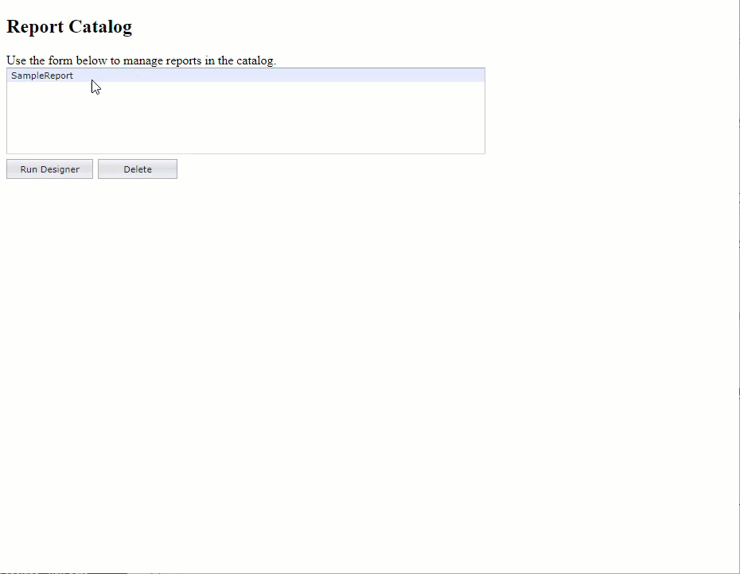

<!-- default badges list -->

[](https://supportcenter.devexpress.com/ticket/details/T190370)
[](https://docs.devexpress.com/GeneralInformation/403183)
<!-- default badges end -->
## Overview
This example demonstrates how to integrate the [Web End-User Report Designer](https://docs.devexpress.com/XtraReports/400216/web-reporting/asp-net-mvc-reporting/end-user-report-designer) to an ASP.NET MVC application. 

The application contains a simple report catalog which you can use to add, delete, and edit reports. You can store [report layouts](https://docs.devexpress.com/XtraReports/2665/detailed-guide-to-devexpress-reporting/store-and-distribute-reports/store-report-layouts-and-documents/save-report-layouts?v=20.2) in a custom data storage: this example uses an MS SQL database.



The  Web Report Designer uses the [ReportStorageWebExtension](https://documentation.devexpress.com/XtraReports/clsDevExpressXtraReportsWebExtensionsReportStorageWebExtensiontopic.aspx) to manage reports: [Add a Report Storage](https://docs.devexpress.com/XtraReports/400204/web-reporting/asp-net-mvc-reporting/end-user-report-designer/add-a-report-storage).


For more information about DevExpress Reporting for ASP.NET MVC, see our documentation: [ASP.NET MVC Reporting](https://docs.devexpress.com/XtraReports/400247/web-reporting/asp-net-mvc-reporting).

## Customize the End-User Report Designer
This example also shows how to redirect to a starting page once a user clicks Menu -> Exit. 
Subscribe to the [ExitDesigner](https://docs.devexpress.com/XtraReports/js-ASPxClientReportDesigner#js_aspxclientreportdesigner_exitdesigner) event and redirect a user to a specified location.
```
function reportDesigner_ExitDesigner(s, e) {
        window.location = '@Url.Action("Index")';
}
```
You can find more customization examples in our documentation: [Customization](https://docs.devexpress.com/XtraReports/400215/web-reporting/asp-net-mvc-reporting/end-user-report-designer/customization).
 
  
*Files to look at*:  
  
  
 - [DesignerController.cs](https://github.com/DevExpress-Examples/Reporting_how-to-integrate-the-web-report-designer-into-an-mvc-web-application-t190370/blob/15.2.4%2B/CS/DXWebApplication_ReportDesigner/Controllers/DesignerController.cs) (VB: [DesignerController.vb](https://github.com/DevExpress-Examples/Reporting_how-to-integrate-the-web-report-designer-into-an-mvc-web-application-t190370/blob/15.2.4%2B/VB/DXWebApplication_ReportDesigner/Controllers/DesignerController.vb))  
 - **[CustomReportStorageWebExtension.cs](https://github.com/DevExpress-Examples/Reporting_how-to-integrate-the-web-report-designer-into-an-mvc-web-application-t190370/blob/15.2.4%2B/CS/DXWebApplication_ReportDesigner/CustomReportStorageWebExtension.cs) (VB: [CustomReportStorageWebExtension.vb](https://github.com/DevExpress-Examples/Reporting_how-to-integrate-the-web-report-designer-into-an-mvc-web-application-t190370/blob/15.2.4%2B/VB/DXWebApplication_ReportDesigner/CustomReportStorageWebExtension.vb))**  
 - [ReportEntity.cs](https://github.com/DevExpress-Examples/Reporting_how-to-integrate-the-web-report-designer-into-an-mvc-web-application-t190370/blob/15.2.4%2B/CS/DXWebApplication_ReportDesigner/DAL/ReportEntity.cs) (VB: [ReportEntity.vb](https://github.com/DevExpress-Examples/Reporting_how-to-integrate-the-web-report-designer-into-an-mvc-web-application-t190370/blob/15.2.4%2B/VB/DXWebApplication_ReportDesigner/DAL/ReportEntity.vb))  
 - [SessionFactory.cs](https://github.com/DevExpress-Examples/Reporting_how-to-integrate-the-web-report-designer-into-an-mvc-web-application-t190370/blob/15.2.4%2B/CS/DXWebApplication_ReportDesigner/DAL/SessionFactory.cs) (VB: [SessionFactory.vb](https://github.com/DevExpress-Examples/Reporting_how-to-integrate-the-web-report-designer-into-an-mvc-web-application-t190370/blob/15.2.4%2B/VB/DXWebApplication_ReportDesigner/DAL/SessionFactory.vb))  
 - [Global.asax.cs](https://github.com/DevExpress-Examples/Reporting_how-to-integrate-the-web-report-designer-into-an-mvc-web-application-t190370/blob/15.2.4%2B/CS/DXWebApplication_ReportDesigner/Global.asax.cs) (VB: [Global.asax.vb](https://github.com/DevExpress-Examples/Reporting_how-to-integrate-the-web-report-designer-into-an-mvc-web-application-t190370/blob/15.2.4%2B/VB/DXWebApplication_ReportDesigner/Global.asax.vb))  
 - [DesignModel.cs](https://github.com/DevExpress-Examples/Reporting_how-to-integrate-the-web-report-designer-into-an-mvc-web-application-t190370/blob/15.2.4%2B/CS/DXWebApplication_ReportDesigner/Models/DesignModel.cs) (VB: [DesignModel.vb](https://github.com/DevExpress-Examples/Reporting_how-to-integrate-the-web-report-designer-into-an-mvc-web-application-t190370/blob/15.2.4%2B/VB/DXWebApplication_ReportDesigner/Models/DesignModel.vb))  
 - [IndexModel.cs](https://github.com/DevExpress-Examples/Reporting_how-to-integrate-the-web-report-designer-into-an-mvc-web-application-t190370/blob/15.2.4%2B/CS/DXWebApplication_ReportDesigner/Models/IndexModel.cs) (VB: [IndexModel.vb](https://github.com/DevExpress-Examples/Reporting_how-to-integrate-the-web-report-designer-into-an-mvc-web-application-t190370/blob/15.2.4%2B/VB/DXWebApplication_ReportDesigner/Models/IndexModel.vb))  
 - [ReportModel.cs](https://github.com/DevExpress-Examples/Reporting_how-to-integrate-the-web-report-designer-into-an-mvc-web-application-t190370/blob/15.2.4%2B/CS/DXWebApplication_ReportDesigner/Models/ReportModel.cs) (VB: [ReportModel.vb](https://github.com/DevExpress-Examples/Reporting_how-to-integrate-the-web-report-designer-into-an-mvc-web-application-t190370/blob/15.2.4%2B/VB/DXWebApplication_ReportDesigner/Models/ReportModel.vb))  
 - [Design.cshtml](https://github.com/DevExpress-Examples/Reporting_how-to-integrate-the-web-report-designer-into-an-mvc-web-application-t190370/blob/15.2.4%2B/CS/DXWebApplication_ReportDesigner/Views/Designer/Design.cshtml)  
 - [Index.cshtml](https://github.com/DevExpress-Examples/Reporting_how-to-integrate-the-web-report-designer-into-an-mvc-web-application-t190370/blob/15.2.4%2B/CS/DXWebApplication_ReportDesigner/Views/Designer/Index.cshtml)  
  
