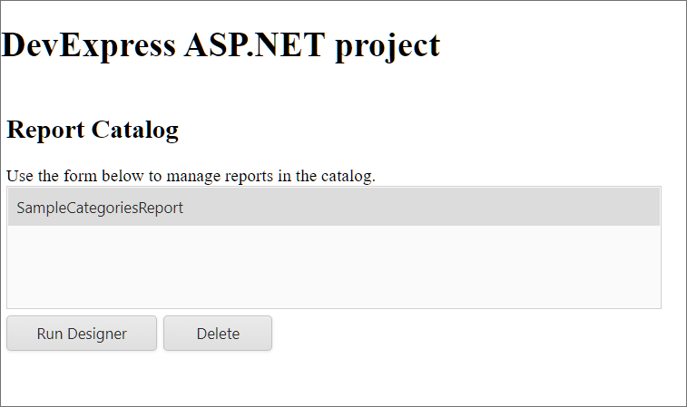
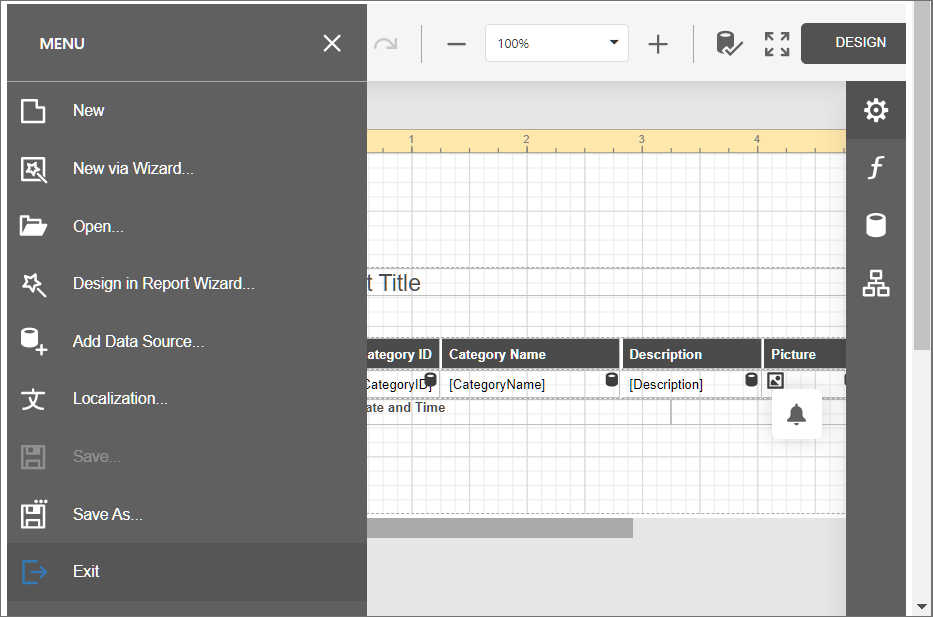

<!-- default badges list -->

<!-- default badges end -->
# Web Reporting ASP.NET MVC Application with End-User Report Designer and Report Database Storage

This example includes [Web End-User Report Designer](https://docs.devexpress.com/XtraReports/400216/web-reporting/asp-net-mvc-reporting/end-user-report-designer) that uses an SQLite database to store reports. 

The Web Report Designer uses the [ReportStorageWebExtension](https://documentation.devexpress.com/XtraReports/clsDevExpressXtraReportsWebExtensionsReportStorageWebExtensiontopic.aspx) to manage reports.

After you run the application, select a report in the list box. The list box displays the names of the reports stored in the database:

Click **Run Designer** to invoke the End-User Report Designer for the selected report. You can edit a report, save it to a database, and exit Designer to return to the report catalog.

## Files to Look At  

 - [HomeController.cs](CS/Mvc_DbStorage_Sample/Controllers/HomeController.cs) (VB: [DesignerController.vb](VB/Mvc_DbStorage_Sample_VB/Controllers/HomeController.vb))  
 - [CustomReportStorageWebExtension.cs](CS/Mvc_DbStorage_Sample/Services/CustomReportStorageWebExtension.cs) (VB: [CustomReportStorageWebExtension.vb](VB/Mvc_DbStorage_Sample_VB/Services/CustomReportStorageWebExtension.vb))  
 - [ReportEntity.cs](CS/Mvc_DbStorage_Sample/DAL/ReportEntity.cs) (VB: [ReportEntity.vb](VB/Mvc_DbStorage_Sample_VB/DAL/ReportEntity.vb))  
 - [SessionFactory.cs](CS/Mvc_DbStorage_Sample/DAL/SessionFactory.cs) (VB: [SessionFactory.vb](VB/Mvc_DbStorage_Sample_VB/DAL/SessionFactory.vb))  
 - [Global.asax.cs](CS/Mvc_DbStorage_Sample/Global.asax.cs) (VB: [Global.asax.vb](VB/Mvc_DbStorage_Sample_VB/Global.asax.vb))  
 - [DesignModel.cs](CS/Mvc_DbStorage_Sample/Models/DesignModel.cs) (VB: [DesignModel.vb](VB/Mvc_DbStorage_Sample_VB/Models/DesignModel.vb))  
 - [IndexModel.cs](CS/Mvc_DbStorage_Sample/Models/IndexModel.cs) (VB: [IndexModel.vb](VB/Mvc_DbStorage_Sample_VB/Models/IndexModel.vb))  
 - [ReportModel.cs](CS/Mvc_DbStorage_Sample/Models/ReportModel.cs) (VB: [ReportModel.vb](VB/Mvc_DbStorage_Sample_VB/Models/Reportmodel.vb))  
 - [Design.cshtml](CS/Mvc_DbStorage_Sample/Views/Home/Designer.cshtml) (VB:[Design.vbhtml](VB/Mvc_DbStorage_Sample_VB/Views/Home/Designer.vbhtml))  
 - [Index.cshtml](CS/Mvc_DbStorage_Sample/Views/Home/Index.cshtml) (VB: [Index.vbhtml](VB/Mvc_DbStorage_Sample_VB/Views/Home/Index.vbhtml))

 ## Documentation

- [End-User Report Designer in ASP.NET MVC Applications](https://docs.devexpress.com/XtraReports/400216/web-reporting/asp-net-mvc-reporting/end-user-report-designer-in-asp-net-mvc-applications)
- [DevExpress Data Library](https://docs.devexpress.com/CoreLibraries/17541/devexpress-data-library)
 - [Add a Report Storage](https://docs.devexpress.com/XtraReports/400204/web-reporting/asp-net-mvc-reporting/end-user-report-designer/add-a-report-storage)

 ## More Examples

 - [How to Implement a Custom Report Storage](https://github.com/DevExpress-Examples/reporting-winforms-custom-report-storage)
 - [Reporting for Web Forms - Report Designer with Report Storage and Custom Command](https://github.com/DevExpress-Examples/reporting-web-forms-designer-storage)
 - [Reporting for WPF - How to Implement a Report Storage](https://github.com/DevExpress-Examples/Reporting_wpf-end-user-report-designer-how-to-implement-a-report-storage-t292945)
